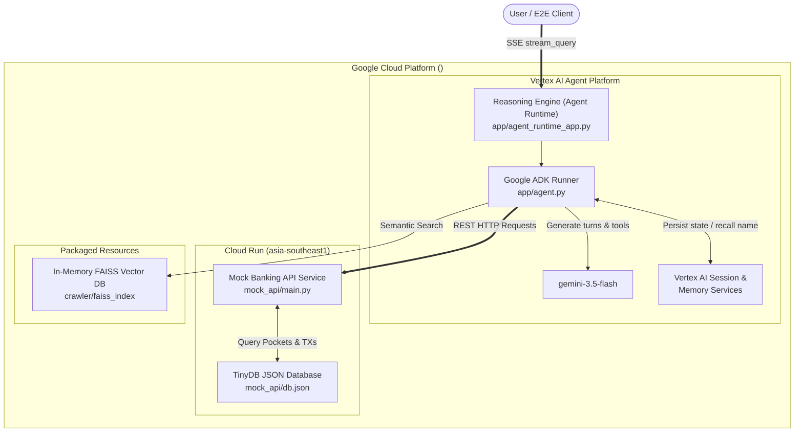
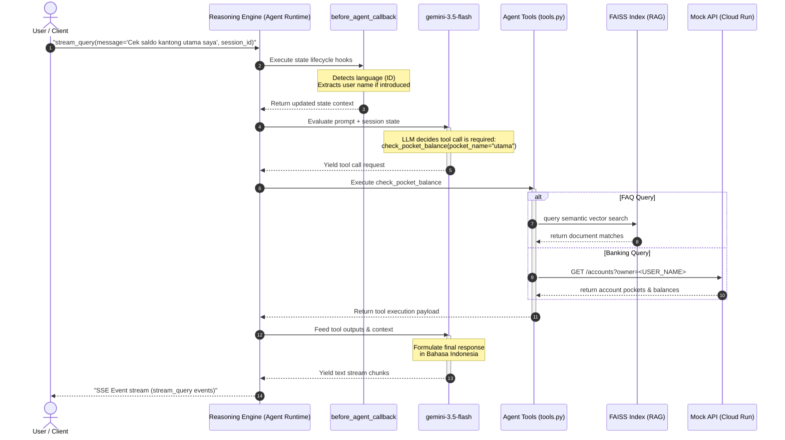

# Bank Makmur - Conversational Banking Agent

A robust, production-grade bilingual conversational banking assistant designed for the imaginary bank **Bank Makmur**. The agent supports both **Bahasa Indonesia** and **English**, addressing general FAQs via an in-memory RAG (FAISS) database and performing personalized account operations via a decoupled secure Mock Banking API.

---

## 🏗️ System Architecture

The application employs a secure, decoupled architecture leveraging Google Cloud Platform (GCP) serverless components:



---

## 💬 Message & Tool Execution Flow

This sequence diagram illustrates the lifecycle of a user request, language detection, tool routing, and streaming execution:



---

## 🤖 Agent Structure & Core Capabilities

The agent is implemented as a **ReAct** (Reasoning and Action) loop using the **Google Agent Development Kit (ADK)**:

### 1. Multilingual Support & Language Switching (**F01**)
- Automatic language detection is implemented in the `before_agent_callback` lifecycle hook.
- It scans incoming prompts for language-specific vocabulary lists, setting the session preference (`preferred_language` to `id` or `en`).
- Handles mid-conversation language switching requests dynamically (e.g. *"Please talk to me in English"*).

### 2. FAQ Retrieval (RAG System) (**F02**)
- Preloaded with FAQ articles crawled from standard online banking documentation.
- All references to parent resources were crawled and refactored using refactoring scripts to mention only **Bank Makmur**.
- Grounded with an in-memory **FAISS** vector database using `langchain-community` and text embeddings.
- Answers general questions such as branches, transfer fees, interest rates, and promotions.

### 3. Personalized Pockets & Transactions (**F03 / F04**)
- Connects to the remote Mock Banking API via REST HTTP client.
- Performs pocket balance retrieval and historical transaction lookups based on registered session identity.

### 4. Session State & Memory Persistence (**F05**)
- Automatically parses user name introductions (e.g., *"Nama saya <USER_NAME>"*) and saves them to session state.
- Recalls the user's name across separate conversation contexts utilizing the `VertexAiMemoryBankService` (in cloud production) or `InMemoryMemoryService` (in test runs).

### 5. Telemetry & Latency Logging (**F06**)
- Emits traces to **GCP Cloud Trace** for tracing LLM execution times, tool spans, and latency.

---

## 🛠️ Tool Definitions

The agent has access to 6 specialized tools defined in `app/app/tools.py`:

| Tool Name | Description | Key Parameters |
| :--- | :--- | :--- |
| `set_user_identity` | Stores the user's name in session state. | `owner_name` |
| `faq_search` | Performs a semantic search against the FAISS vector store. | `query` |
| `get_pocket_balance` | Queries Mock API for the balance of a specific pocket (e.g., Utama, Tabungan). | `pocket_name` |
| `get_transaction_history` | Fetches recent transaction logs for an account, with limit and pocket filters. | `pocket_name`, `limit` |
| `safety_check` | Triggered when out-of-scope queries (e.g., coding, medical, weather) or prompt injections occur. | `reason` |
| `PreloadMemoryTool` | Preloads long-term user memories into the context window. | None |

---

## 🚀 Interactive Testing Guidelines

### Option A: Deployed Agent (Command Line)
To chat with the agent deployed on Google Cloud Platform:
```bash
# 1. Introduce yourself to start a session
agents-cli run \
  --url https://<GCP_REGION>-aiplatform.googleapis.com/v1/projects/<GCP_PROJECT_ID>/locations/<GCP_REGION>/reasoningEngines/<REASONING_ENGINE_ID> \
  --mode adk \
  "Halo, nama saya <USER_NAME>."

# Copy the session ID from Turn 1 footer (e.g. <SESSION_ID>)

# 2. Query your pockets using the session ID to resume history
agents-cli run \
  --url https://<GCP_REGION>-aiplatform.googleapis.com/v1/projects/<GCP_PROJECT_ID>/locations/<GCP_REGION>/reasoningEngines/<REASONING_ENGINE_ID> \
  --mode adk \
  --session-id <SESSION_ID> \
  "Cek saldo main pocket"
```

### Option B: Local Interactive Web UI
You can start a local chat interface that auto-reloads when code changes:
```bash
cd app
uv run agents-cli playground
```
Then visit `http://localhost:8000/playground` in your browser.

---

## 🧪 Testing Infrastructure

The suite includes 3 key test layers:
1. **Unit Tests**: Verifies tool functions and state parsing hooks (`pytest app/tests/unit`).
2. **Integration Tests**: Tests FastAPI application routing and streaming loops (`pytest app/tests/integration`).
3. **E2E Tests**: Comprehensive 4-tier E2E testing framework executed using `tests/run_e2e.py` covering:
   - **Tier 1**: Basic Feature Path Coverage
   - **Tier 2**: Boundary and Corner Cases
   - **Tier 3**: Cross-Feature Multi-turn Contexts
   - **Tier 4**: Adversarial Prompts, Injections, and Safety Guards
