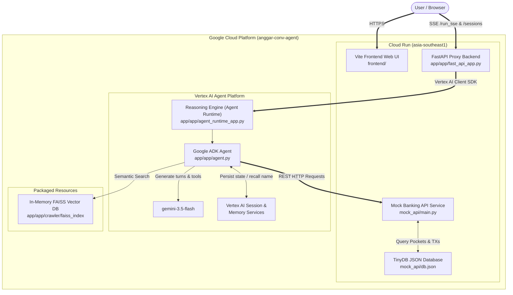
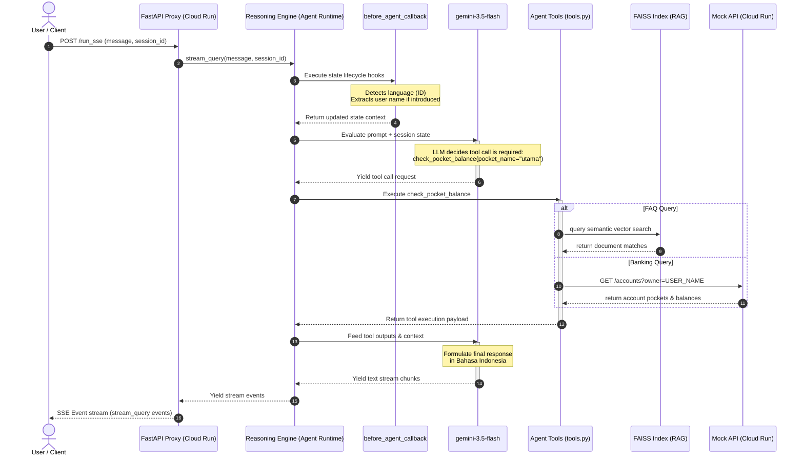

# Bank Makmur - Conversational Banking Agent

A robust, production-grade conversational banking application designed for the imaginary bank **Bank Makmur**. The project features:
1. **Bilingual Conversational Agent**: Implemented with Google ADK (Agent Development Kit) supporting both **Bahasa Indonesia** and **English**, addressing general FAQs via an in-memory RAG (FAISS) database, and performing personalized account operations.
2. **Aurora Styled Frontend**: A mobile-first Vite + React + TypeScript chat interface designed with a premium Google Gemini-style Aurora gradient theme, streaming assistant responses in real time using Server-Sent Events (SSE).

---

## 🏗️ System Architecture

The application employs a secure, decoupled architecture leveraging Google Cloud Platform (GCP) serverless components:



---

## 💬 Message & Tool Execution Flow

This sequence diagram illustrates the lifecycle of a user request, language detection, tool routing, and streaming execution:



---

## 🚀 Deployed Services

* **Frontend Web UI**: `https://bank-makmur-frontend-<PROJECT_NUMBER>.<REGION>.run.app`
* **Agent Backend API**: `https://bank-makmur-mock-api-<PROJECT_NUMBER>.<REGION>.run.app`

---

## 🖥️ Frontend Web App (Tanya Makmur)

The Vite frontend provides a premium chat interface tailored to simulate the mobile-first "Tanya Jago" app layout but styled with Gemini Aurora gradient themes (cool blues, purples, and pinks):
* **Real-time SSE Stream Parsing**: Captures and renders text chunks as they stream back from the Vertex AI Reasoning Engine.
* **Loading/Lookup States**: Shows a dynamic status bar ("Looking up that information for you...") when waiting for backend reasoning.
* **Nginx Containerization**: Deployed via Nginx on Cloud Run with dynamic port binding (`$PORT`) and SPA routing fallbacks.
* **E2E Testing Harness**: Configured with Playwright E2E browser tests that run headless browser scenarios simulating name introductions, safety checks, and pocket balance updates.

---

## 🤖 Agent Structure & Core Capabilities

The agent is implemented as a **ReAct** (Reasoning and Action) loop using the **Google Agent Development Kit (ADK)**:

### 1. Multilingual Support & Language Switching
- Automatic language detection is implemented in the `before_agent_callback` lifecycle hook.
- Scans prompts for language keywords, updating the session's `preferred_language` (`id` or `en`).
- Handles mid-conversation language switching requests dynamically (e.g. *"Please talk to me in English"*).

### 2. FAQ Retrieval (RAG System)
- Grounded with an in-memory **FAISS** vector database using `langchain-community` and text embeddings.
- Answers questions about branches, transfer fees, interest rates, and promotions.

### 3. Personalized Pockets & Transactions
- Performs pocket balance retrieval and historical transaction lookups based on registered session identity via the Mock Banking API.
- Normalizes Indonesian pocket names (e.g. "kantong utama") to English backend pocket equivalents ("main pocket") dynamically.

### 4. Session State & Memory Persistence
- Automatically parses user name introductions and persists identity across separate conversations utilizing the `VertexAiMemoryBankService` (in cloud production) or `InMemoryMemoryService` (in test runs).

---

## 🛠️ Tool Definitions

The agent has access to 6 specialized tools defined in `app/app/tools.py`:

| Tool Name | Description | Key Parameters |
| :--- | :--- | :--- |
| `set_user_identity` | Stores the user's name in session state. | `owner_name` |
| `faq_search` | Performs a semantic search against the FAISS vector store. | `query` |
| `get_pocket_balance` | Queries Mock API for the balance of a specific pocket (e.g., Utama, Tabungan). | `pocket_name` |
| `get_transaction_history` | Fetches recent transaction logs for an account, with limit and pocket filters. | `pocket_name`, `limit` |
| `safety_check` | Triggered when out-of-scope queries (e.g., coding, medical, weather) or prompt injections occur. | `reason` |
| `PreloadMemoryTool` | Preloads long-term user memories into the context window. | None |

---

## 🚀 Interactive Testing Guidelines

### Running the Entire Application Locally

1. **Start the Backend Agent Playground**:
   ```bash
   cd app
   uv run agents-cli playground
   ```
   This starts the local FastAPI server at `http://127.0.0.1:8000`.

2. **Start the Vite Frontend Web UI**:
   In a separate terminal:
   ```bash
   cd frontend
   npm install
   VITE_API_URL=http://127.0.0.1:8000 npm run dev
   ```
   Then open `http://localhost:5173` in your browser.

---

## 🧪 Testing Infrastructure

The suite includes 4 key test layers:
1. **Backend Unit Tests**: Verifies tool functions and state parsing hooks (`pytest app/tests/unit`).
2. **Backend Integration Tests**: Tests FastAPI application routing and streaming loops (`pytest app/tests/integration`).
3. **Frontend Component Tests**: Verifies React components and layouts locally (`npm run test` in `frontend`).
4. **Playwright E2E Tests**: Headless browser testing verifying browser interactions, SSE streaming, name introduction, and balance formatting (`npm run test:e2e` in `frontend`).
